# LP App Endpoints

### Base URL - logistics.homble.in/

<i>
<u>A first time lp</u>: An lp must first register using the homble consumer app. Upon creating the profile, Growth/Ops head can mark can_be_lp flag on User - TBF. The lp can then open and start using the lp app

 

<u>Permissions</u>: LP100 series will be reserved for the riders. On adding pickers to the lp app, LP200 will be allocated for them.
</i>

 

## Login

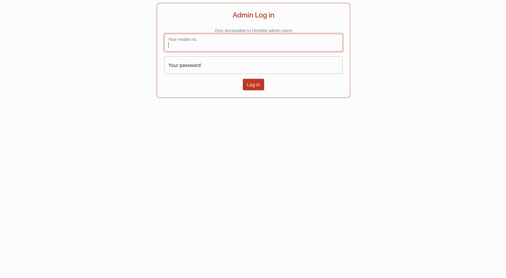

1. <b>POST send-otp/ </b>

   Check for can_be_lp on the user table. Returns 403 if false

   Permissions: AllowAny

   [Request](./lp/login/send-otp/request.json)

   [Response](./lp/login/send-otp/response.json)

2. <b>POST login/ </b>

   Allows an lp to login with OTP

   Permissions: AllowAny

   [Request](./lp/login/login/request.json)

   [Response](./lp/login/login/response.json)

3. <b>POST logout/ </b>

   Allows a registered Homble lp to log out from the app

   Permissions: IsAuthenticated

   Request: NONE

   Response: NONE

 

## Profile

Will just show user(rider) info for now - same like Account -> My Profile on the consumer app

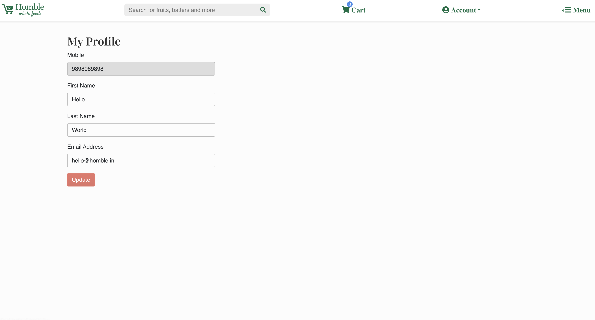

1. <b>GET profile/ </b>

   Gets details of a registered lp

   Permissions: IsAuthenticated

   Request: NONE

   [Response](./lp/profile/profile/response.json)

## Collect

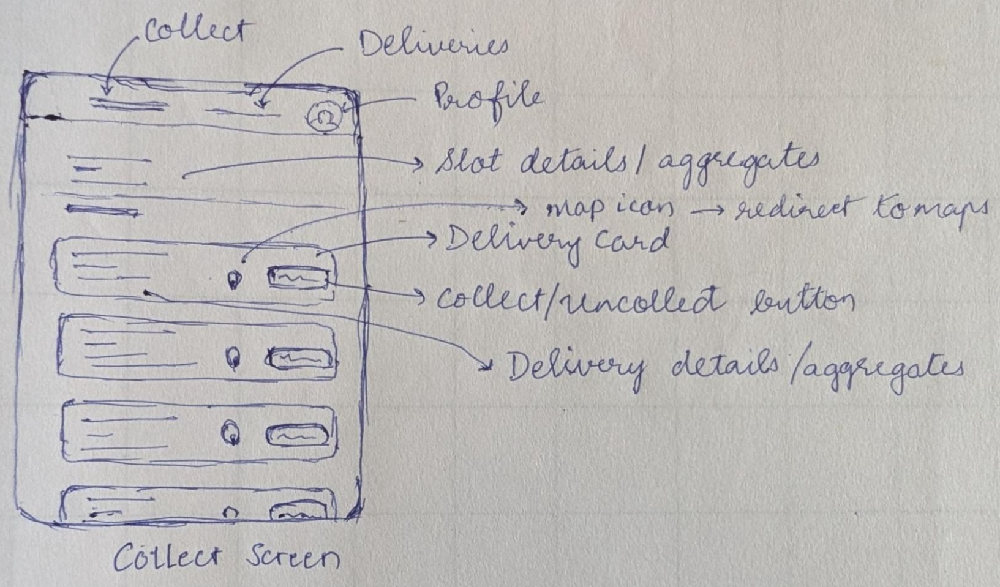

Details and updates:

1. Slot to be shown: show latest slot with incomplete deliveries assigned to rider
2. Slots details - Start to end time, collected on total deliveries, total POD to be collected
3. Delivery details - Order Ids, Contact name and address, and POD to be collected (Contact Mobile number only for slots with OTP requirement)
4. Colour code delivery cards (based on whether collected or not)
5. Remove Uncollect option -> button does not show up for collected deliveries
6. Functionality to view all pins simultaneously??

 

1. <b>GET deliveries_to_collect/ </b>

   Gets all the slot level deliveries that are assigned to the rider

   Permissions: LP100

   Request: NONE

   [Response](./lp/collect/assigned-deliveries/response.json)

2. <b>PATCH deliveries/mark-collected/ </b>

   Collect deliveries

   Permissions: LP100

   [Request](./lp/collect/deliveries/mark-collected/request.json)

   [Response](./lp/collect/deliveries/mark-collected/response.json)

## Deliveries

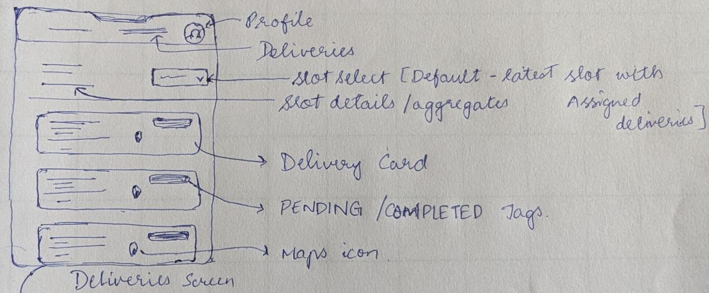

Details and updates:

1. Slot to be shown: Latest slot with assigned and collected deliveries. NO DROP DOWN
2. Past deliveries only via menu on Profile (don't show cust phone num)
3. Slots details - Start to end time, pending on total deliveries, collected on total POD (values)
4. Delivery details - Order Ids, Contact name and address, and POD to be collected (Contact Mobile number only for slots with OTP requirement)
5. Separate Pending and Completed orders in different sections - maintain colour code
6. Functionality to view all pins simultaneously
7. V2 - Auto-Sequencing?

 

1. <b>GET live-deliveries/ </b>

   Get live deliveries in a particular slot.

   Permissions: LP100

   Request: NONE

   [Response](./lp/deliveries/live-deliveries/response.json)

### Delivery Modal

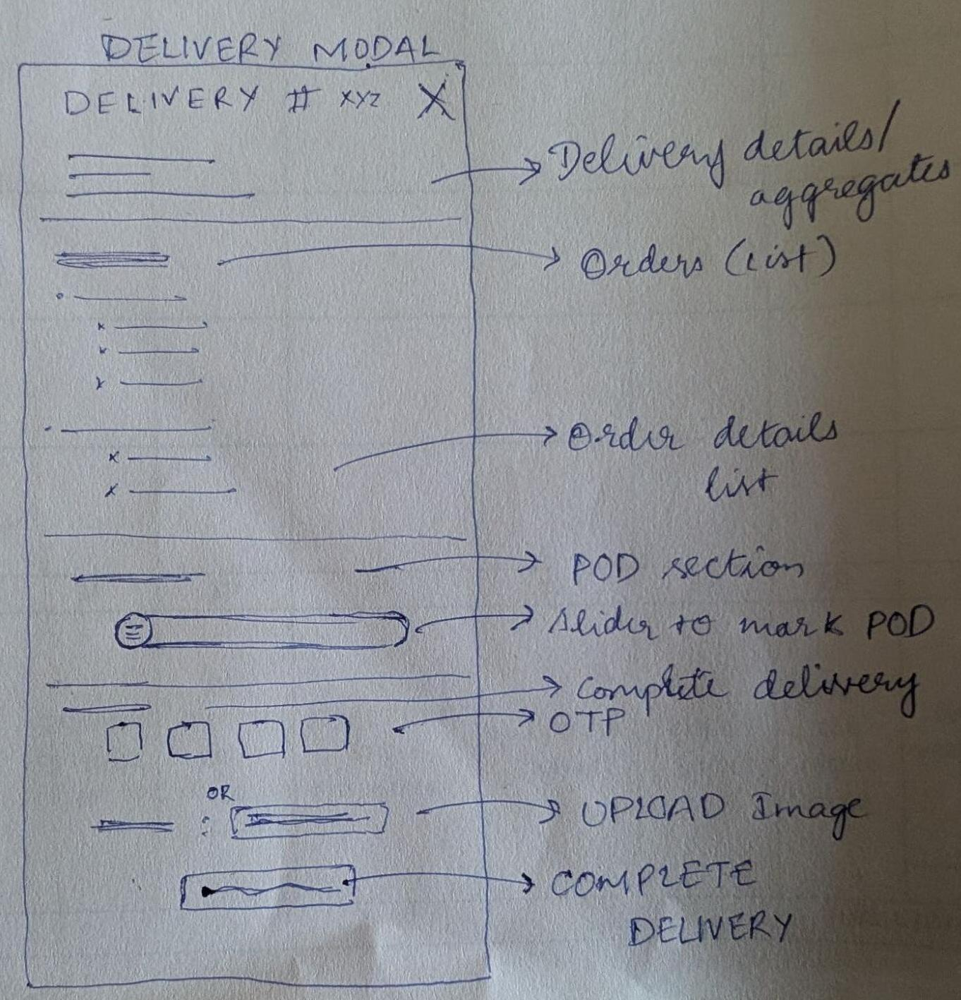

Details and updates:

1. Delivery details - Order Ids, Contact name and address (Contact Mobile number only for slots with OTP requirement), map icon, resend OTP icon
2. POD - Amount to be collected
3. Either OTP or Upload Image depending on the slot(contact or non-contact slots??)
4. V2 - Generating QR link for direct payments to Homble

 

1. <b>GET deliveries/<delivery_id>/ </b>

   Get Delivery details

   Permissions: LP100

   Request: NONE

   [Response](./lp/deliveries/deliveries/response.json)

2. <b>POST deliveries/<delivery_id>/resend-otp/ </b>

   Resend otp to customer for a delivery

   Permissions: LP100

   Request: NONE

   [Response](./lp/deliveries/deliveries/otp/response.json)

3. <b>PATCH deliveries/<delivery_id>/mark-pod-collected/ </b>

   Mark all PODs related to a delivery

   Permissions: LP100

   Request: NONE

   [Response](./lp/deliveries/deliveries/mark-pod-collected/response.json)

4. <b>PATCH deliveries/<delivery_id>/mark-completed/ </b>

   Mark a delivery as completed

   Permissions: LP100

   [Request](./lp/deliveries/deliveries/mark-completed/request.json)

   [Response](./lp/deliveries/deliveries/mark-completed/response.json)

## Auxiliary(from rider app)

1. <b>POST lat-long/ </b>

   This end point is called every minute[on the minute] to update the live location of the rider

   Permissions: LP100

   [Request](./lp/auxiliary/lat-long/request.json)

   Response: NONE, 201 CREATED or 200 OK

   <u>Notes for tech</u>: Check for good practices

 

# Ops Hub Endpoints

### Base url - hub.homble.in/

## Route Planning

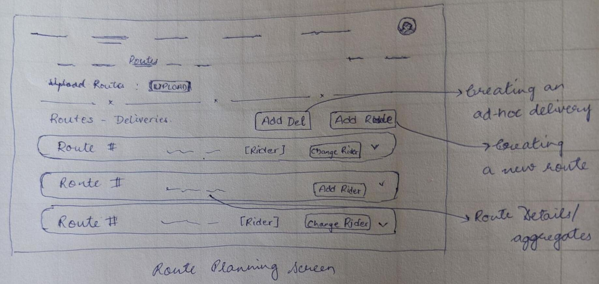

Details and updates:

<i><u>NOTE</u>: Routes take precedence over rider</i>

1. Default - All deliveries in UNASSIGNED route
2. Upload - delivery_id, route, rider_id
   1. If both route and rider are empty - no action will be taken
   2. One rider for a route, multiple routes per rider
   3. Any error in inconsistencies - no action taken, will throw up the first
3. Slot level details/aggregates - assigned deliveries / total deliveries, allocated routes / total routes, Total POD value(count), # of riders
4. Route details - ref, # of completed deliveries / total deliveries, POD - value(count) completed / total, Rider name(if allocated)
   1. Actions - Edit, Delete, Change Rider

 

1. <b>GET slots/ </b>

   Gets all the slots for past two days

   Permissions: IsAdmin

   Request: NONE

   [Response](./ops/route-planning/slots/response.json)

2. <b>GET slots/<slot_id>/deliveries/ </b>

   Gets all the deliveries along with the routes assigned

   Permissions: IsAdmin

   Request: NONE

   [Reponse](./ops/route-planning/slots/deliveries/response.json)

3. <b>GET address/<address_id>/ </b>

   Get the address corresponding to the id

   Permissions: IsAdmin

   Request - NONE

   [Response](./ops/route-planning/address/response.json)

   [Response - In case of error](./ops/route-planning/address/error-response.json)

4. <b>GET slots/<slot_id>/routes/ </b>

   Get all the existing routes

   Permissions: IsAdmin

   Request: NONE

   [Response](./ops/route-planning/slots/routes/response.json)

5. <b>GET slots/<slot_id>/riders/ </b>

   Get all the existing riders

   Permissions: IsAdmin

   Request: NONE

   [Response](./ops/route-planning/slots/riders/response.json)

6. <b>POST deliveries/ </b>

   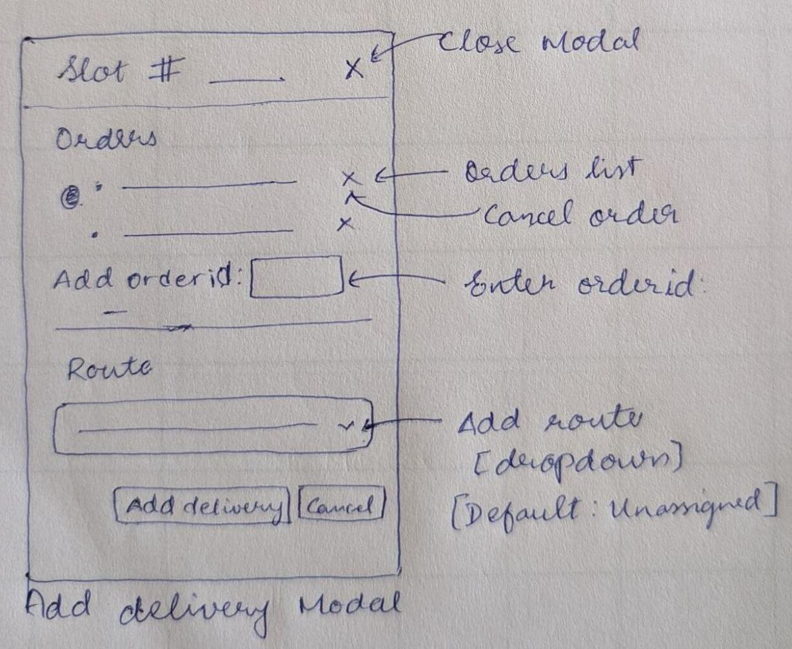

   

Details and Updates

   1. Replace Orders with Address id (Submit button),the form field above the address details.

   

    

   Creates a new delivery

   Permissions: OPS100

   [Request](./ops/deliveries/request.json)

   [Response](./ops/deliveries/response.json)

7. <b>POST routes/ </b>

   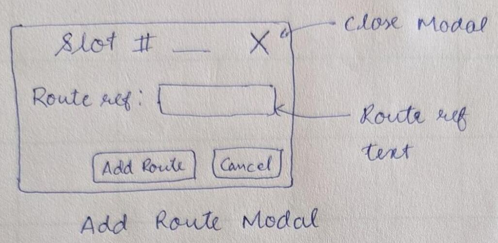

   

Details and Updates

   1. V2 - Assign deliveries too?

   

    

   Creates a new route

   Permissions: OPS100

   [Request](./ops/routes/request.json)

   [Response](./ops/routes/response.json)

    

### Routes Accordian Body

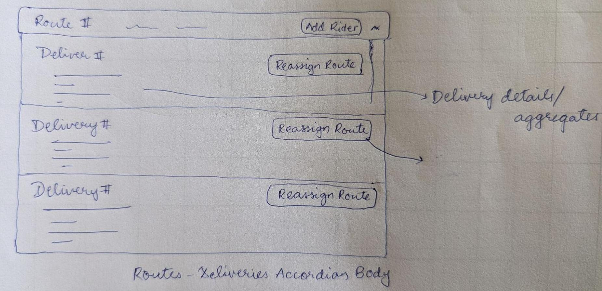

Details and Updates

1.  Delivery card details - Contact details, Addresses, Order Ids List, POD
2.  Delivery proof for completed deliveries

 

1. <b>PATCH routes/<route_id>/allocate-rider/ </b>

   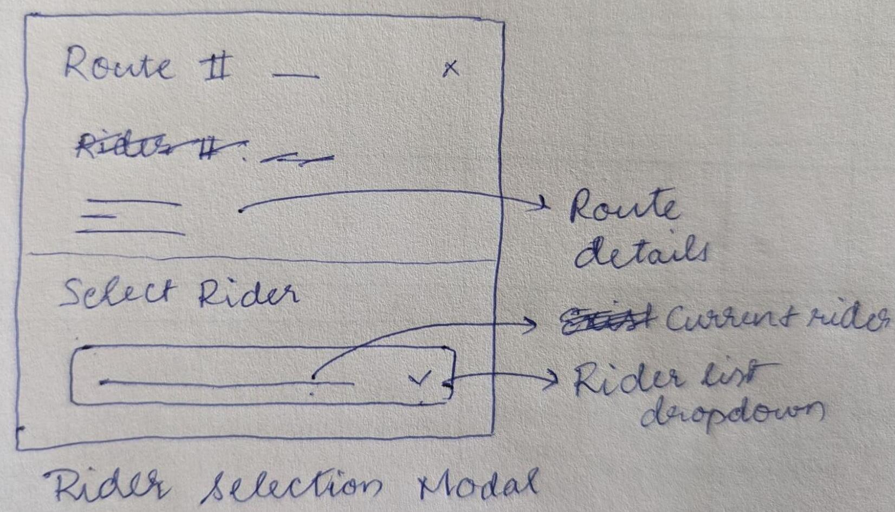

   

Details and Updates

   1. Submit and Cancel buttons
   2. Modal expansion for list of deliveries
   3. Delivery details - addresses and # orders

   

    

   Allocates a rider to a route

   Permissions: OPS100

   [Request](./ops/routes/allocate-rider/request.json)

   [Response](./ops/routes/allocate-rider/response.json)

2. <b>PATCH deliveries/<delivery_id>/assign-route/ </b>

   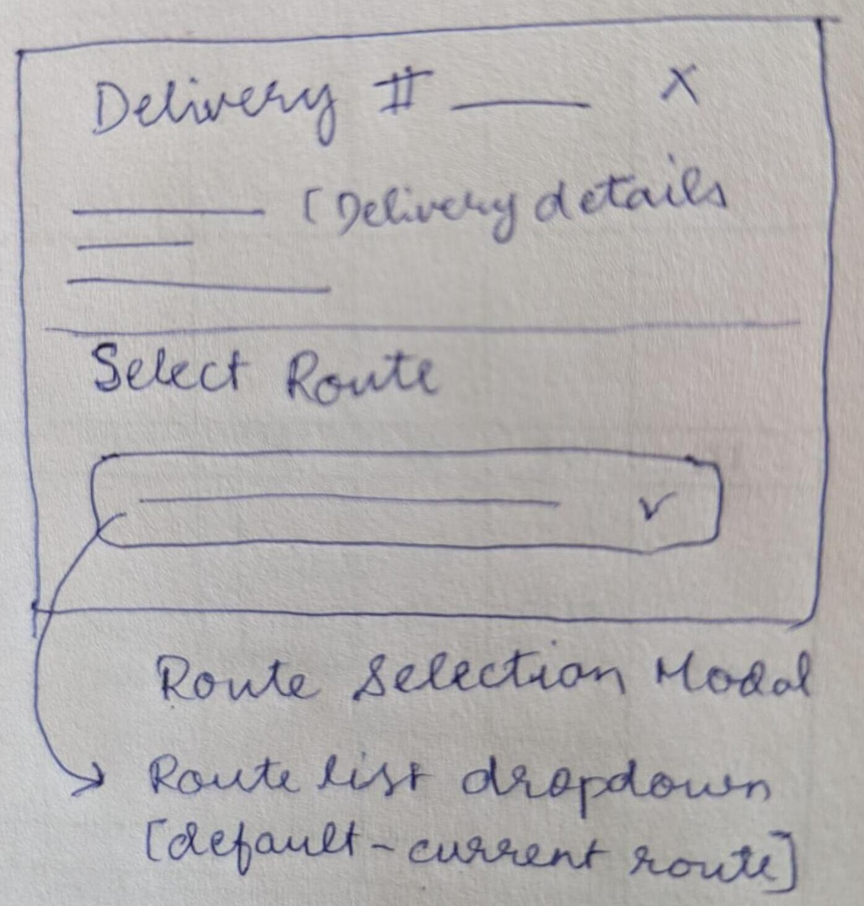

   

Details and Updates

   1. Route text will have rider detail in brackets if assigned
   2. Cancel and Submit buttons

   

    

   Assigns route for a delivery

   Permissions: OPS100

   [Request](./ops/deliveries/assign-route/request.json)

   [Response](./ops/deliveries/assign-route/response.json)

    

### Delivery Modal

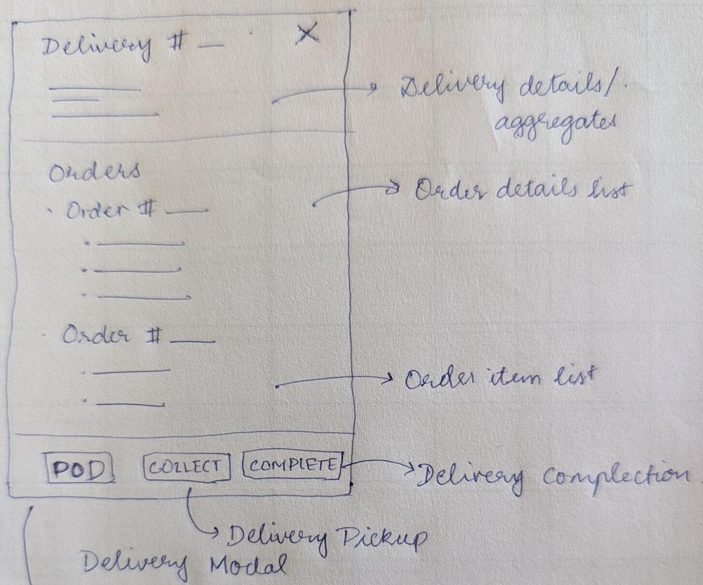

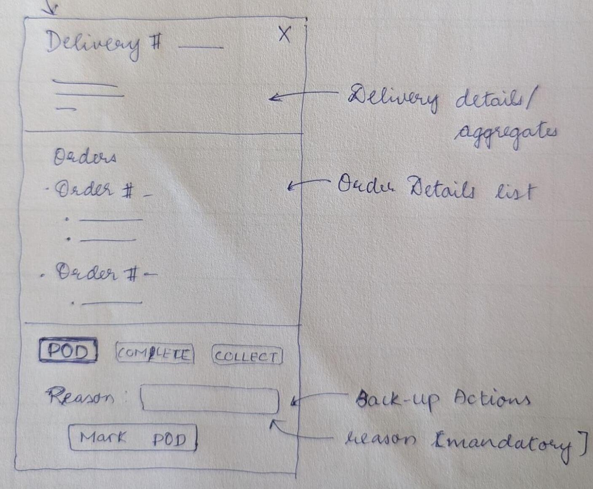

Details and updates:

1. Resend OTP button
2. Cancel button

 

1. <b>POST deliveries/<delivery_id>/resend-otp/ </b>

   Resend OTP to the customer for the delivery.

   Permissions: OPS100

   Request: NONE

   [Response](./ops/deliveries/otp/response.json)

2. <b>PATCH deliveries/<delivery_id>/mark-pod-collected/ </b>

   Marks all POD payments related to delivery

   Permissions: OPS100

   Request: NONE

   [Response](./ops/deliveries/mark-payment/response.json)

3. <b>PATCH deliveries/mark-dispatched/ </b>

   Marks the delivery as started

   Permissions: OPS100

   [Request](./ops/deliveries/mark-dispatched/request.json)

   [Response](./ops/deliveries/mark-dispatched/response.json)

4. <b>PATCH deliveries/<delivery_id>/mark-delivered/ </b>

   Marks a delivery as completed and all the corresponding orders as delivered

   Permissions: OPS100

   Request: NONE

   [Response](./ops/deliveries/mark-delivered/response.json)

## Live Deliveries

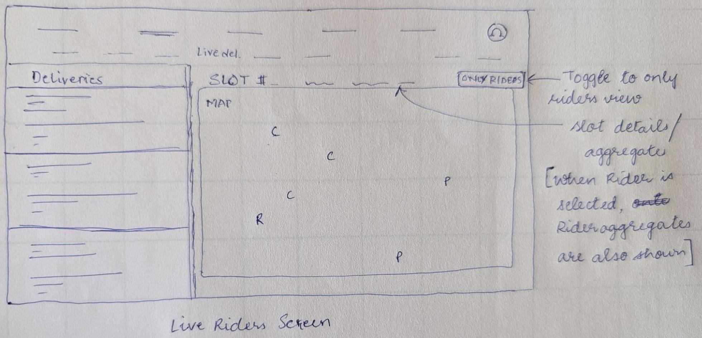

Details and updates:

1. Rider Actions button/icon to open up delivery (ops) back-up actions
2. Finalisation time - to - finalisation time
3. Don’t show deliveries and pins for a rider who has finished all deliveries
4. Deliveries pending(on top) and completed sorting

 

1. <b>GET live_deliveries/ </b>

   Gets all the live deliveries for a given slot along with the rider info, if the rider has any pending deliveries

   Permissions: IsAdmin

   Request: NONE

   [Response](./ops/live-deliveries/live-deliveries/response.json)

    

### Delivery Modal

Details and updates:

1. Resend OTP button
2. Cancel button

 

1. <b>POST deliveries/<delivery_id>/resend-otp/ </b>

   Resend OTP to the customer for the delivery.

   Permissions: OPS100

   Request: NONE

   [Response](./ops/deliveries/otp/response.json)

2. <b>PATCH deliveries/<delivery_id>/mark-pod-collected/ </b>

   Marks all POD payments related to delivery

   Permissions: OPS100

   Request: NONE

   [Response](./ops/deliveries/mark-payment/response.json)

3. <b>PATCH deliveries/mark-dispatched/ </b>

   Marks the delivery as started

   Permissions: OPS100

   [Request](./ops/deliveries/mark-dispatched/request.json)

   [Response](./ops/deliveries/mark-dispatched/response.json)

4. <b>PATCH deliveries/<delivery_id>/mark-delivered/ </b>

   Marks a delivery as completed and all the corresponding orders as delivered

   Permissions: OPS100

   Request: NONE

   [Response](./ops/deliveries/mark-delivered/response.json)

## Auxiliary

### Delivery Create

Modify `place_or_prepare` method in Order model to either

1. create a Delivery and add the order
    
   (OR)
    
2. Add order to an existing delivery
3. Update the confirmation notification template, with the OTP too.
